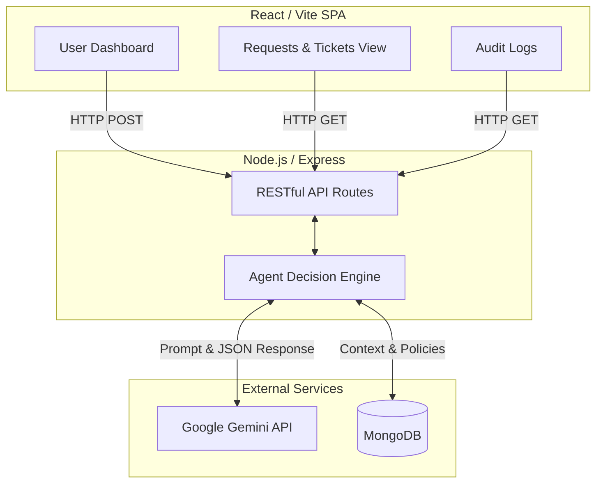
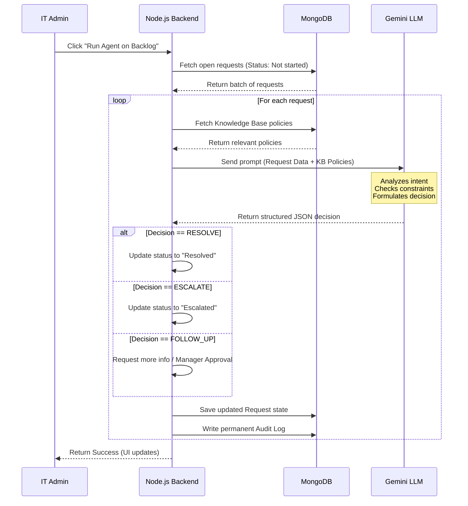
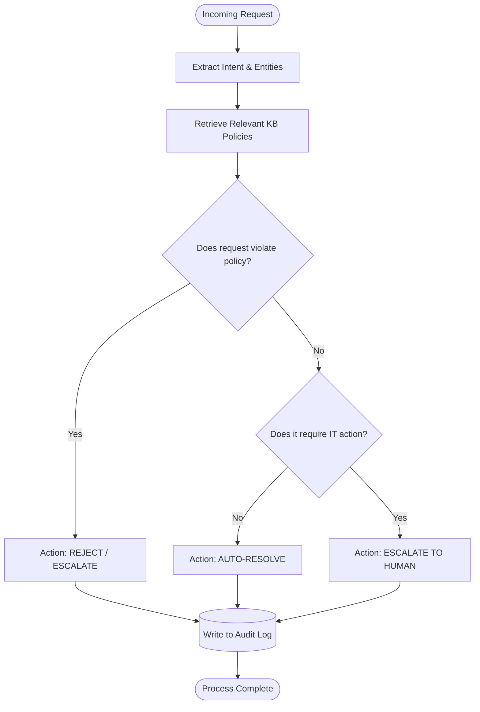

# Veridian Corp Autonomous IT Agent

An intelligent, AI-powered IT Service Desk Agent designed for Veridian Corp. This system automates the triage, classification, and resolution of unstructured employee IT requests by evaluating them against a corporate Knowledge Base (KB).

---

## 🏛️ High-Level Architecture

The system is built on a decoupled architecture, separating the client-side dashboard from the intelligent decision-making backend.

---

## 🔄 Request Processing Workflow

When the system processes the backlog of employee requests, it follows a strict sequence to ensure accuracy, safety, and traceability.

---

## 🧠 The AI Decision Engine

The core of the system is the autonomous AI agent. It acts as a rigid, policy-driven classifier rather than an open-ended chatbot. It is explicitly instructed to never hallucinate policies and to always base decisions strictly on the provided KB.

---

## 💻 Technology Stack & Rationale

* **Frontend: React + Vite** 
  * *Rationale:* Provides a highly responsive Single Page Application (SPA). Vite offers exceptional development speed. The UI is built with modular components (Dashboards, Tables, Audit Logs) and utilizes native CSS variables for seamless light/dark mode switching.
* **Backend: Node.js & Express** 
  * *Rationale:* Maintaining a unified JavaScript stack across the frontend and backend reduces context switching. Express is lightweight and highly unopinionated, making it perfect for standing up rapid REST APIs that interface with the AI engine.
* **Database: MongoDB (Mongoose)** 
  * *Rationale:* IT requests, chat history, and audit logs are inherently document-based and unstructured. A NoSQL database like MongoDB allows for flexible schema design, enabling us to easily store nested AI entity extractions without complex SQL migrations.
* **AI Engine: Google Gemini API**
  * *Rationale:* Gemini is utilized for its exceptional speed and robust `responseMimeType: "application/json"` capability. This guarantees that the LLM returns perfectly structured JSON (Decision, Reasoning, Target Status) directly to the backend without parsing errors.

---

## 🚀 Local Setup & Installation

To run this environment locally, you will need Node.js installed.

### 1. Environment Configuration
Duplicate the `.envexmaple` file in both the `/frontend` and `/backend` directories. Rename them to `.env` and insert your MongoDB URI and Gemini API Key.

### 2. Backend Initialization
\`\`\`bash
cd backend
npm install
npm run seed  # Wipes the DB and populates the initial Assignment 2 test data
npm run dev
\`\`\`

### 3. Frontend Initialization
\`\`\`bash
cd frontend
npm install
npm run dev
\`\`\`

Navigate to `http://localhost:5173` to access the Veridian Corp IT Dashboard.
